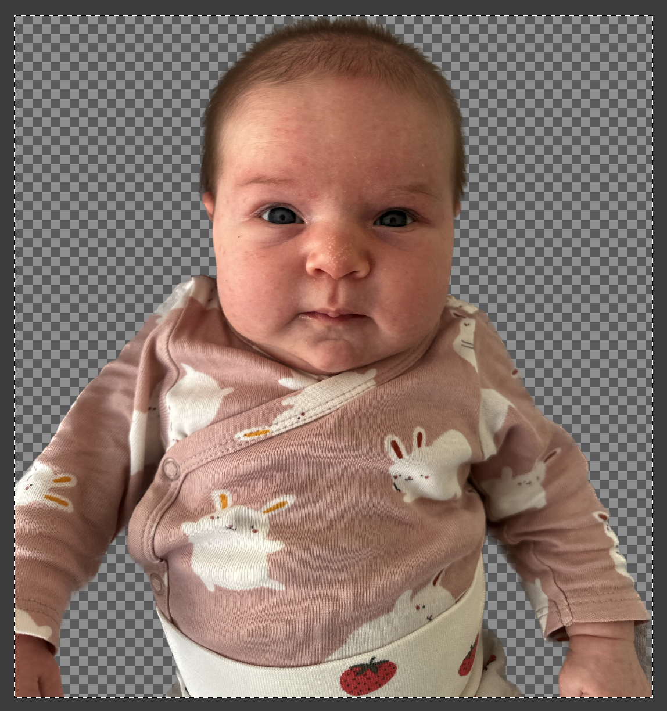
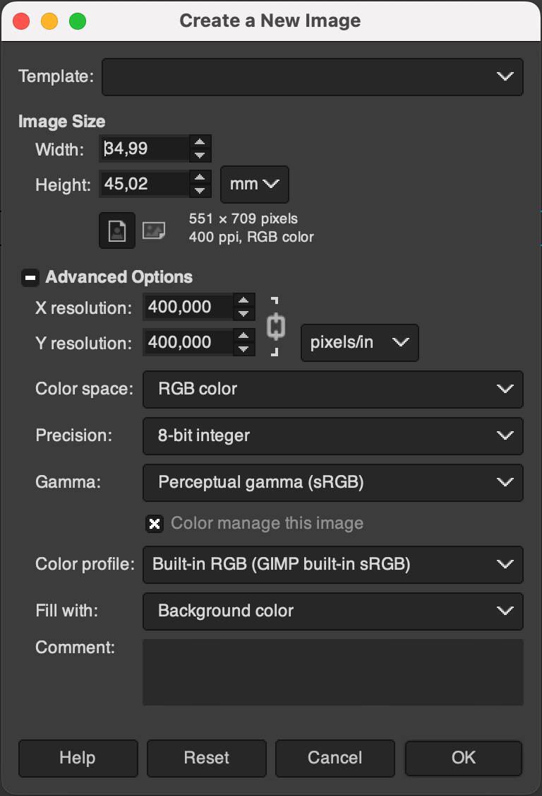
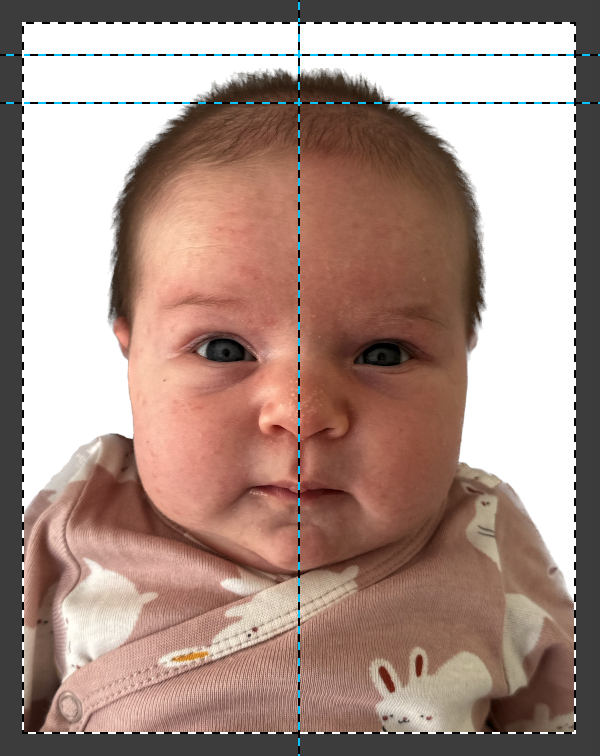
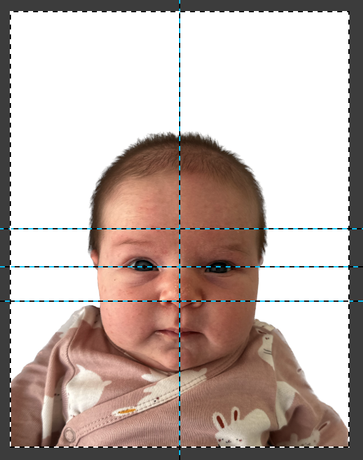
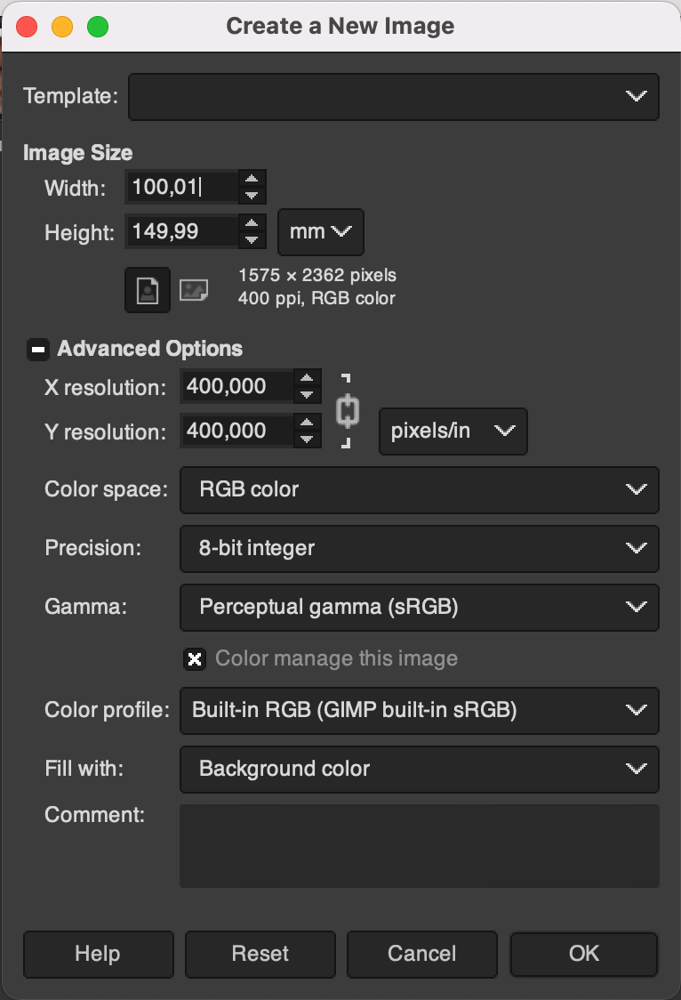
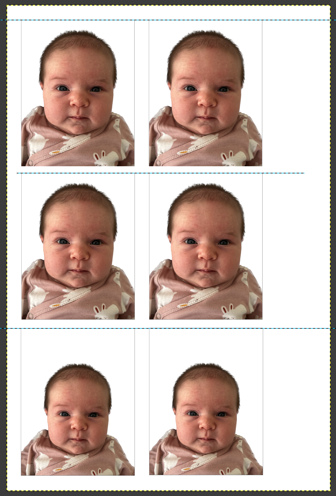

# Фото на документы самостоятельно

### Делаем подходящую фотографию

Самый просто способ сходить в фотоателье. Но сфотографировать очень маленького ребенка, который еще не в состоянии держать голову, будет очень проблематично.

Поэтому одеваем ребенка в яркую и контрастную одежду, укладываем на белую простыню так, чтобы на ребенка падал яркий дневной свет из окна и делаем много фотографий. Оптимально снимать на айфоны последних поколений.

### Вырезаем силуэт ребенка

Если у вас есть **Photoshop** - используйте его, если нет - сойдет **Gimp**.

Открываем самое удачное фото и вырезаем фон вокруг ребенка.

Можно воспользоваться фишкой айфона, если зажать палец на человеке в фото то человека автоматически вырежет. Дальше можно дочистить полученный результат в фоторедакторе.

На выходе этого шага у нас должно быть что-то вроде:

### Создаем шаблон для фото

Создаем новый шаблон 35 x 45 мм, с плотностью 400 x 400. пикселей на дюйм.

Такой же шаблон создаем для фото для IND.

### Фото для консульства

Позиционируем и масштабируем ребенка. Верхний край головы должен быть на расстоянии от 2 до 5 мм от верхнего края кадра. Овал головы по высоте от 30 до 34 мм.

Делаем рамочку 1px вокруг фото: `Filters -> Decor -> Add border...`

### Фото для IND

[Требования к фото.](https://www.government.nl/topics/identification-documents/requirements-for-photos)

Делаем рамочку 1px вокруг фото: `Filters -> Decor -> Add border...`

### Делаем фотокарточку для печати 10x15

    
    

Печатаем на обычном принтере и проверяем что все размеры сошлись.

### Печатаем наше фото в 2x экземплярах

Вы можете сделать другую компановку, отдельно лист фото для консульства, отдельно для IND, но для IND нам на самом деле нужно только 1 фото.

Самый дешевый и простой способ печати - **Kruidvat**. Не знаю во всех ли, но в моем есть автомат для печати фото.

Но, есть ньюанс, фото на печати слегка увеличивается, вместо 35 на 45, получается 36 на 47. Поэтому для печати в круидвате я отмасштабировал ВНУТРЕННОСТИ кадра с коэф. 0,95. Сам кадр остался 10x15, а фотографии ребенка внутри были уменьшены на 5%.

Даже без масштабирования можно подрезать фотографии до номинала используя прямые руки и канцелярский нож.

Второй вариант по печати, но более дорогой - <https://www.profotonet.com/nl/fotoafdrukken/fotoafdrukken-kleur/>

Посылают фотографии через PostNL, в Амстердам в течение двух дней после заказа. В таком формате приняли в консульстве - 10x15-11x15 lustre(mat).