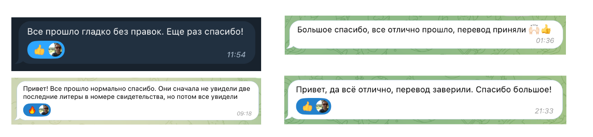

# Ребенок рожденный в Нидерландах

Процесс легализации ребенка после рождения:
* Регистрация рождения в муниципалитете (Gemeente) и получение выписки о рождении **международного формата**
* Получение residence permit на ребенка в IND
  * Подача заявления на сайте IND
  * Отправка формуляра с фотографией обычной почтой
  * Получение готового пермита в IND 
* Получение гражданства РФ и загранпаспорта РФ (оба родителя граждане РФ)
  * Апостилирование выписки в окружном суде
  * Выполнение перевода свид. о рождения на русский язык
  * Заверение перевода в консульстве
  * Получение гражданства
  * Получение загранпаспорта

## Регистрация в Gemeente

В течение 3 рабочих дней не считая день самого рождения необходимо зарегистрировать ребенка в Gemeente того города где он был рожден!

Для регистрации понадобятся только пермиты обоих родителей!

**Присутствие ребенка НЕ требуется.**

Обязательно попросите выдать вам **международную выписку** (UITTREKSEL UIT DE GEBOORTEAKTE) из свидетельства о рождении (стоит примерно 15 евро). Хотя, по факту это именно выписка из свидетельства о рождении дальше мы будем называть ее просто "Свидетельство о рождении".

Обязательно прочтите [этот документ](https://netherlands.mid.ru/upload/iblock/2ec/4pzoikb20p5e64lreklgecsm5f5av0pt.doc) перед регистрацией.

Сразу после получения выписки я рекомендую поставить [апостиль](#апостиль), однако это будет нужно уже в консульстве.

## Фотография

Как можно раньше (когда спадут первые отеки) начинайте попытки поймать удачный кадр для фотографии на документы. Нам понадобится 2 варианта фото, для IND и для консульства РФ.

И то и то фото имеет размеры 3,5 на 4,5 см, но разную компоновку фото.

**Теперь у нас появляются 2 параллельных трека задач: получение Residence permit в IND и Получение гражданства РФ и загранпаспорта РФ в консульском отделе в Гааге.**

## Получение residence permit на ребенка в IND

Пермит можно получать сразу, для этого при заполнении заявки ставим что у ребенка нет паспорта. 

[Полное описание процесса от IND тут.](https://ind.nl/en/residence-permits/family-and-partner/residence-permit-for-child-born-in-the-netherlands)

### Отправка заявления на пермит

Просто идете и заполняете заявление (ребенок рожденный в Нидерландах) на [Mijn IND](https://ind.nl/nl/mijn-ind).

### Отправка фотографии ребенка

После заполнения анкеты вам будет нужно выслать фото ребенка обычной почтой [по форме](https://ind.nl/en/forms/7630.pdf).

Ребенка в возрасте до 1 года не фотографируют в офисе IND, поэтому фото нужно будет изготовить самостоятельно.

[Требования к фото](https://www.government.nl/topics/identification-documents/requirements-for-photos) аналогичны требованиям к фото на визу D.

[Как сделать фото своими руками](newborn-photos.md)

### Ожидания подтверждения от IND

Ждем пока не придет письмо о том, что можно записываться на получение пермита. Сначала может прийти письмо, что они в целом согласны его выдать, но ждут пока вы пришлете им фото.

### Запись на получение пермита

[Записываемся на получение пермита](https://ind.nl/en/appointment-to-collect-residence-document)

Для получения пермита паспорт ребенка сейчас не требуют.

**Ребенок нужен физически!**

## Получение гражданства РФ и загранпаспорта РФ (оба родителя граждане РФ)

### Апостиль

На свидетельство о рождении (международную выписку) необходимо поставить Апостиль.

[Апостиль ставится в суде](https://www.rechtspraak.nl/Onderwerpen/apostille-legalisatie/Paginas/Overzicht-rechtbanken.aspx).

В Амстердамском суде это делается на Центральной Стойке (не путать с ресепшен) с 8:30 до 17:00 в любой рабочий день без предварительной записи.

Естественно нужен оригинал документа и деньги для оплаты картой - 22,5 евро.

### Перевод свидетельства о рождении на русский язык

Перевод можно сделать **самостоятельно**, у **присяжного переводчика** и **у меня**.

#### Я могу сделать вам перевод с красивым и аккуратным шаблоном за донат в 38 евро 🙂 

Мои переводы принимают без исправлений и дополнений.

Пишите мне [https://t.me/nightflash13](https://t.me/nightflash13) в Телеграм.

Отзывы на мои переводы:

Присяжный перевод стоит не менее 100 евро и зачастую имеет очень посредственный шаблон и качество исполнения.

Учтите, что перевод будет подшиваться к свидетельству и будет сопровождать ребека всю жизнь.

### Запись на прием в консульство и подготовка документов

Для оформления документов необходимо [записаться на прием](http://hague.kdmid.ru), для каждого шага требуется отдельный слот, кроме случаев когда консульство предоставляет комплекс (тогда там будет указано какие действия включены в комплекс).

При подготовке документов ознакомьтесь с полезными памятками:
* [образец памятка по подготовке заявления на гражданство](https://netherlands.mid.ru/upload/iblock/e7f/hu0vw854c05p69a6f86cmx3rhoqbh0fd.doc)
* [правила транслитерации](https://netherlands.mid.ru/upload/iblock/8e6/ppx6das73ztk61vpwn91ne8kpva5ob5j.pdf)
 
Главное правило - вы даете документ и его копию для каждого шага. Лучше принести что-то лишнее.

Место выдачи свидетельства о рождении во всех заявлениях указываем так, как оно было переведено! Например: "Отдел ЗАГС Амстелвен"

### Заверение перевода свидетельства о рождении

Требуемые документы:
* Оригинал свидетельства о рождении с апостилем
* Распечатанный перевод свидетельства на русский язык
* Заграничный российский паспорт + ксерокопия первой страницы

Рекомендуется взять с собой на флешке текст перевода, чтобы если что-то пойдет не так они могли вам его поправить.

В результате вам выдают оригинал свидетельства о рождении к которому подшивают перевод.

Стоимость: 47 евро

Присутствие ребенка не требуется.

### Получение гражданства

Требуемые документы:
* [Заявление заполненное онлайн](https://nation.kdmid.ru/) и распечатанное с двух сторон одного листа!!!
* Оригинал свидетельства о рождении с апостилем и подшитым переводом (см. предыдущий шаг)
* Копия свидетельства о рождении
* Заграничный российский паспорт обоих родителей + ксерокопия первой страницы каждого
* Пермиты обоих родителей + ксерокопии каждого с 2 сторон
* [1 фото (официально требуется 3, делайте 3)](newborn-photos.md)

Стоимость: бесплатно

Присутствие ребенка не требуется.

### Получение загранпаспорта

Требуемые документы:

* [Заявление заполненное онлайн](https://nation.kdmid.ru/) и распечатанное с двух сторон одного листа!!!
* Оригинал свидетельства о рождении с апостилем, подшитым переводом и пометкой о гражданстве (см. предыдущий шаг)
* Копия свидетельства о рождении
* Заграничный российский паспорт заявителя + ксерокопия
* Внутренний российский паспорт заявителя + ксерокопия первой страницы и прописки
* [2 фото (официально требуется 3, делайте 3)](newborn-photos.md)

Стоимость: 9 евро

**Ребенок нужен физически!**

## Сказать спасибо

Я буду признателен за донат на кофе и пироженку.

* В России: [Тинькофф](https://www.tbank.ru/cf/8KsxuxtnBwm)
* В Европе: [Revolut](https://revolut.me/spbmax)