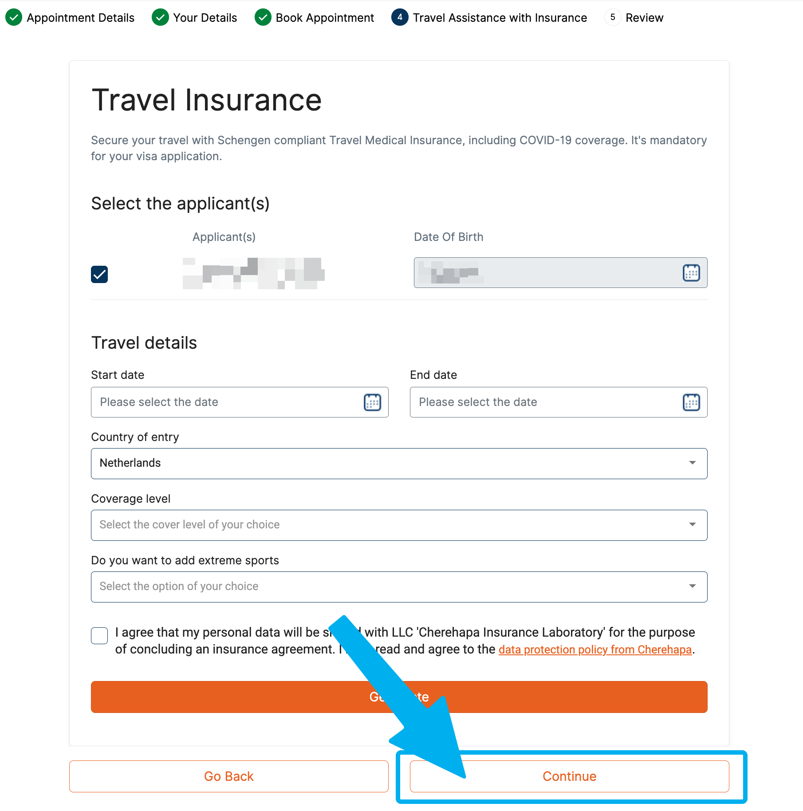
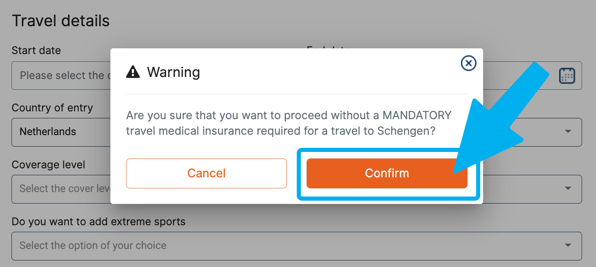

# Виза для родственников

## Общая информация

[Актуальная информация в оригинале](https://www.netherlandsworldwide.nl/crisis/russia):
"Are you coming to the Netherlands for a maximum of 90 days to visit family? And do you have 1st or 2nd degree relatives in the Netherlands? Then you can apply for a Schengen visa at VFS Global in Moscow from July 31, 2023." 

В настоящее время визы с целью посещения родственников выдаются для 1-й и 2-й категории родства.

* 1-я категория: супруг, родитель (включая усыновителя), ребенок (включая усыновленных)
* 2-я категория: брат, сестра, внуки, бабушки, дедушки, сводный брат/сестра, невестка, зять

Заявление подается в визовом центре **В МОСКВЕ ЛИЧНО**.

Заявление подается **не раньше, чем за 6 месяцев до поездки**.

В других городах РФ подать заявление на визу **нельзя**. Удаленно подать тоже **нельзя**.

Вне зависимости от того является ли приглашающий резидентом или гражданином Нидерландов сейчас выдаются **только однократные визы** на срок пребывания 30-45-60-90 дней.

## Визовый центр

[Vfs Global](https://visa.vfsglobal.com/rus/ru/nld/attend-centre/moscow)    

Адрес: Каширское ш., 3, корп. 2, стр. 9, Москва • БЦ Сириус Парк, этаж 2

* [Ссылка на Яндекс карты](https://yandex.ru/maps/org/vfs_global/196140491828/?ll=37.631460%2C55.672488&z=15)
* [Ссылка на Google карты](https://www.google.com/maps?&z=16&q=55.672512,37.630748)

## Приглашение (спонсорское письмо)

Для того чтобы Ваш родственник мог податься на визу ему необходимо предоставить спонсорское письмо. Оно включает в себя 2 пункта:

* Спонсорство (покрытие всех расходов связанных с пребыванием)
* Предоставление размещения (жилья)

В зависимости от Gementee данный документ можно сделать либо полностью онлайн (напр. [Амстердам](https://www.amsterdam.nl/veelgevraagd/bewijs-van-garantstelling-of-onderdak-voor-bezoek-uit-het-buitenland-2f94a#:~:text=Een%20Bewijs%20van%20garantstelling%20of,is%20nodig%20voor%20een%20visum.)*, Амстелвейн) или [распечатать](https://ind.nl/nl/formulieren/1310.pdf) и затем просто заверить подпись ([legalisatie handtekening](https://www.amsterdam.nl/veelgevraagd/waar-kan-ik-mijn-handtekening-laten-legaliseren-2e812-kp)) в **любой** Хементе.

_* Для онлайн приглашения сделанного через хементу Амстердама может не напечататься номер паспорта, его будет нужно вписать руками._

При заверении подписи при себе иметь загран паспорт и permit/id.

Если вы не просто предоставляете жилье, но **выступаете финансовым гарантом**, то подписывать документ должны **ОБА ПАРТНЕРА (зарегистрированное партнерство) или СУПРУГА**.

Спонсорское письмо нужно предоставлять в **ОРИГИНАЛЕ**, это значит его будет необходимо переправить в РФ (почтой или [с кем-то по пути](https://t.me/benelux_post_pool)).

## Необходимые документы

[Список от визового центра.](https://www.vfsglobal.com/one-pager/netherlands/russia/russian/pdf/check-list-Copy-3.pdf)
 
От приглашающей стороны:
* Оригинал приглашения не старее 6 месяцев;
* 3 последних зарплатных листка (payslips) — попросить / скачать в бухгалтерии на работе;
* Копии паспорта и residence permit (обоих, если приглашение подписывали вдвоем);
* Копии свидетельства о рождении или прочие документы, подтверждающее родство с приглашенными;
* Не обязательно: an employer’s statement (Справка от работодателя, werkgeversverklaring);
* Не обязательно: копия рабочего контракта;

От посещающей стороны:
* Копия свидетельства о рождении / о заключении брака / смене фамилии (документы подтверждающие родственные связи);
* Копия загран. паспорта с фото и визами, копия внутреннего паспорта;
* [Европейская страховка](#страховка);
* [Бронь авиабилетов](#бронь-авиабилетов)
* Справку с работы, если есть
* Документы на собственность, если есть
* Загранпаспорт
* [Визовая анкета](#визовая-анкета)
* Фотография на шенген
* Для пенсионеров: пенсионное (его не выдают с 2015 года; поэтому — справку о назначенной пенсии. Заказать в личном кабинете на сайте СФР: раздел «Пенсии» —> «Заказать справку (выписку) о назначенных пенсиях и социальных выплатах (на дату)»)

### Бронь авиабилетов

Для оформления визы требуется бронь авиабилетов, это в большей степени **формальность**, пока что не было ни одного случая отказов по причине билетов. Визовый центр сам просит именно бронь, а не выкупленные билеты.

Бронь должна быть действительна **на момент подачи документов визовый центр**.

Бронь необходима вне зависимости от статуса приглашающего - гражданин или резидент.

Вы **можете** купить возвратные билеты, никто не запрещает. Можно купить билеты разных авиакомпаний на разные сегменты, разных маршрутов.

Самый дешевый и простой способ - оформить бронь на [euroavia.ru](http://euroavia.ru) (ок. 1.000₽).

### Страховка

Российские страховки **НЕ ПРИНИМАЮТСЯ!**

Требуемые параметры страховки:
- Территория страхования: Шенген или Весь мир.
- Минимальная сумма страхового покрытия: 30.000 евро.
- Даты страховки: соответственно датам из визовой анкеты (или шире).

Страховые компании позволяющие застраховать граждан РФ:
- [oomverzekeringen.nl](http://www.oomverzekeringen.nl)
- [schengen.insure](https://www.schengen.insure/en)
- [swisscare.com](https://swisscare.com/en/wizard)
- [mondialcare.eu](https://www.mondialcare.eu/schengen-travel-insurance/)

## Подача заявления на визу

Далее вам (родственнику) нужно [записаться на подачу документов](https://visa.vfsglobal.com/rus/en/nld) в визовый центр в Москве.

Есть 2 чата в Telegram, [один общий](https://t.me/visa_babushek), в [другом пишут когда появляются слоты](https://t.me/slots_visa_babushek).

Слоты бывают 2 типов:
* обычный, стоимость примерно 10.000₽ на человека (это сумма консульского сбора, услуг визового центра и пересылки паспорта вам обратно)
* премиум - все включено, включая заполнение анкеты и фотография, стоимость примерно 20.000₽ на человека (то же самое + 10к за индивидуальное обслуживание)

Вид слота **не влияет** на скорость оформления визы, срок визы и проч.!

Заранее подготовьте в **электронном виде** (блокнот, заметки или пр. текстовый файл) следующую информацию по каждому заявителю:

- ФИО (на английском, как в загран. паспорте)
- дата рождения (dd.mm.yyyy), при вставке дата будет перевернута, это нормально!
- номер паспорта
- срок действия паспорта (dd.mm.yyyy), при вставке дата будет перевернута, это нормально!
- телефон
- электронная почта
- также будет нужно выбрать **пол** и **гражданство**, но это делается через компонент с опциями, скопировать результат не получится

Во время оформления слота (записи в визовый центр) есть шаг со страховкой, его **НАДО ПРОПУСКАТЬ** (см. ниже)!!!

## Визовая анкета

Визовую анкету необходимо **заполнять на компьютере**, заполненные от руки не принимаются!

Визовая анкета заполняется на **АНГЛИЙСКОМ** языке. 

* [Русский язык](https://consular.mfaservices.nl/assets/documents/pdf/forms/schengen_visa_application_form_russian.pdf) 
* [Английский язык](https://consular.mfaservices.nl/assets/documents/pdf/forms/schengen_visa_application_form_english.pdf)
* [Общая ссылка на анкеты](https://consular.mfaservices.nl/schengen-visa) (см. внизу страницы)

## Сроки

Сроки выполнения визы разняться, однако в среднем это 3 недели на саму визу и 3-5 дней на доставку. Таким образом для безопасности **закладывайте минимум 4 недели**!

Отследить статус заявки [можно тут](https://www.vfsvisaservicesrussia.com/Global-Passporttracking/Track/Index?q=shSA0YnE4pLF9Xzwon/x/MI24mBrB3J1rBC1vdDKa5IQdrJXKYTs+DdVJBpH9l4lWnAN3TLRYw6v+MSKQf/1qLGw6TqTA4D675SpJr4T4QA=).
