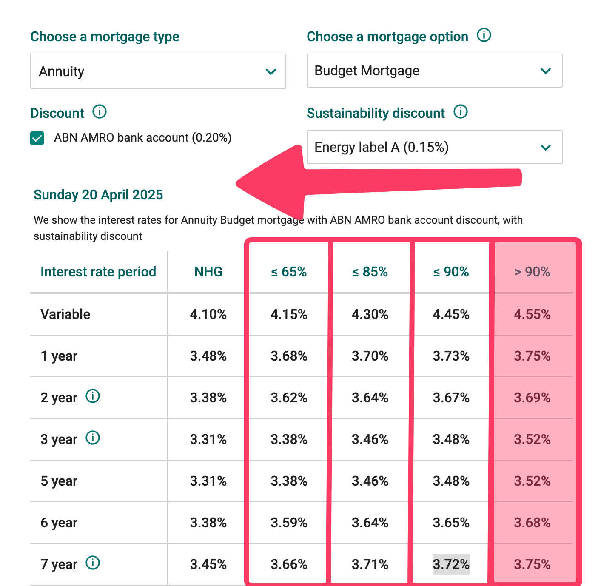
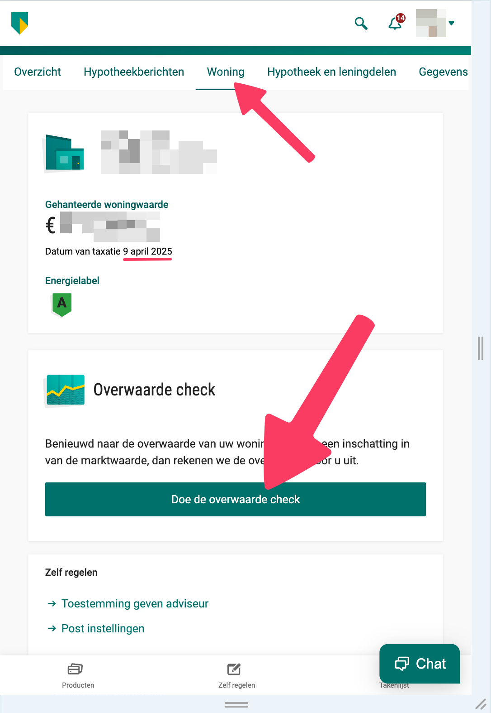

# Снижение процентной ставки

Когда вы берете ипотеку то фиксируете процентную ставку на какой-то период (3-5-10 лет). В течение этого периода нельзя снизить ставку без штрафа. 

Кроме того, процентная ставка тем выше, чем меньше вклад ваших собственных средств (первый взнос).

Там 4 брекета в зависимости от суммы ипотеки относительно текущей рыночной стоимости дома:
1. 90% - 100% - вы берете ипотеку на больше чем 90% стоимости дома
2. 85% - 90%
3. 65% - 85%
4. 0% - 65%

Однако, существует возможность незначительно снизить ставку абсолютно бесплатно.

С течением времени происходит 2 процесса:
1. Вы выплачиваете часть основного долга
2. Ваша недвижимость сама по себе дорожает (увеличивается рыночная стоимость)

Таким образом через какое-то время ваша ипотека движется влево по брекетам.

Для того чтобы снизить ставку, нужно обратиться в банк и предоставить им информацию о новой рыночной стоимости.

Вам потребуется новая оценка, но многие банки для этой цели принимают онлайн оценку от [calcasa.nl](https://calcasa.nl/). Стоимость на 2025 год - 25 евро.

В ABN загрузить оценку можно в личном кабинете, **но только в веб версии**!

Для этого идем в **Overzicht** Ипотеки, затем кликаем на нашу **недвижимость** и затем нажимаем на **Overwaarde check**.

В моем случае спустя 2 года произошел переход из брекета 90-100 в 85-90, причем через пару месяцев возможно удастся по той же таксации прыгнуть в 65-85.

Процентная ставка **снизилась с 4,50% до 4,45%**.

### Сказать спасибо

> ☕️ **Угостите автора чашечкой кофе**  
> [**Подарить кофе →**](../donate.md)
