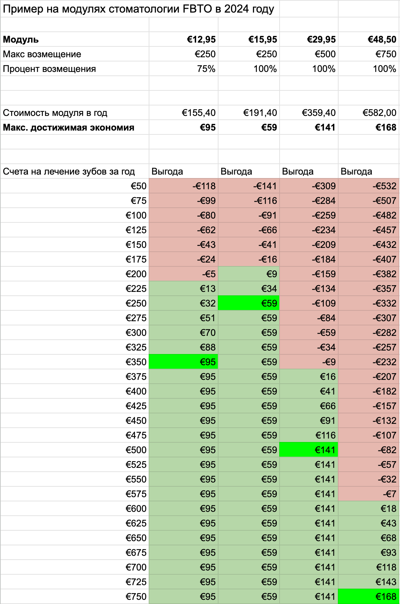

## Страховка

Итак, любая медицинская система начинается со страховки. В Нидерландах каждый резидент обязан быть застрахован с первого дня своего пребывания в стране. Страховка довольно дорогая, на 2023 год это минимум 135 евро на взрослого человека в месяц.

Дети автоматически  страхуются по наилучшей страховке своего родителя и за них вы ничего не платите (до достижения ими 18-летнего возраста).
С момента прибытия в страну у вас будет 4 месяца, чтобы оформить страховку, но не важно, оформите вы ее в 1 день или на 3 месяц вы все все равно оплатите ее с 1 дня пребывания. В этом заключается хитрость, почему не страшно болеть с самого начала (хотя лучше не болейте). Страховая потом все ретроспективно возместит (или удержит из вашей франшизы, но об этом чуть позже).

### Собственный риск

Теперь поговорим о страшном - **франшиза**, или так называемый **собственный риск Eigen risico** (эйхе рисико).
**На 2023 год он составляет 385 евро в год** и вы платите эту сумму (не всю, а сколько потратили) если обращаетесь к врачам специалистам, сдаете анализы, получаете лекарства и прочее. Но не платите если обращаетесь на прием к своему семейному врачу. Как только франшиза закончилась (полностью выплачена) страховая перестает списывать с вас дополнительные деньги. На картинке пример более чем на половину потраченной франшизы.

### Как выбрать

Итак, как же выбрать хорошую страховку? В целом все страховки одинаково хороши, потому что клиники и врачи везде одни и те же. Цены отличаются тоже довольно незначительно. Обычно есть 3 уровня базовой страховки (названия могут отличаться). В своей книге я привожу в пример компанию FBTO, исторически так получилось что я купил именно их страховку:
[fbto.nl](https://www.fbto.nl/zorgverzekering/basisverzekering)

Отличаются они в основном только списком клиник с которых вы получаете 100% возмещение услуг. Однако не стоит забывать про франшизу, которую вы успеете выплатить перед этим, так что не всегда есть необходимость брать дорогую страховку, особенно если вы относительно здоровый человек и не планируете посещать специалистов и пить лекарства.

В дополнение к "базе" на страховку можно повесить различные дополнительные модули, вроде физиотерапии и стоматологии.

**Важный момент:** изменить страховую компанию или набор дополнительных модулей можно только 1 раз в году (в декабре).

Сайт для сравнения страховок: [independer.nl](https://www.independer.nl/zorgverzekering/intro.aspx)

### Стоматология

Стоматология не входит в базовую страховку, поэтому цените и лечите свои зубы.

Вы можете добавить стоматологию (и ортодонтию) как дополнительный модуль за дополнительную стоимость.

Важно понимать что страховка стоматологии это на самом деле:

* небольшая скидка в случае полного или почти полного израсходования стоимости самой страховки
* рассрочка платежей по зубам

Т.е. объективно вы просто заплатите за ремонт своих зубов не разом большую сумму, а просто размажете ее на весь год.

При этом, если вы не сходите к врачу, или стоимость услуг будет сильно меньше то вы просто выбросите эти деньги.

Ниже я прилагаю небольшой пример расчета стоматологических модулей от FBTO:

Для примера возьмем самый дешевый модуль за 12,95. По нему можно получить максимально 250 евро, но есть особенность, с каждого счета он возмещает не более 75%. Т.е. для полного расхода надо потратить 333 евро. Суммарная экономия при этом составит 95 евро (вы заплатили 155 евро за страховку в год, а вам выплатили 250)!

Следующий модуль вдвое менее выгоден, но тут все зависит от ваших расходов, если вы потратите не 300 евро, а 200, то он все еще сделает вас в плюсе на целых 9 евро.

Если ничего кроме планового осмотра вы не планируете, то зубную страховку можно смело игнорировать. В любом случае, даже в самом лучшем сценарии и самой дорогой страховке она обеспечит лишь полторы сотни евро экономии.

Главное учтите, что менять страховку или добавлять в нее модули можно только 1 раз в конце года!

> ☕️ **Угостите автора чашечкой кофе**  
> [**Подарить кофе →**](../donate.md)
