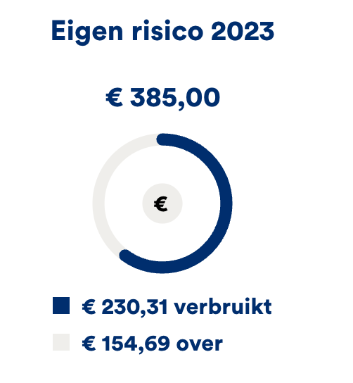

# Страховка

Итак, любая медицинская система начинается со страховки. Если вы живёте или работаете в Нидерландах, вам, как правило, нужна нидерландская базовая медицинская страховка — **basisverzekering**. В 2026 году [средняя стоимость базовой страховки](https://www.rijksoverheid.nl/vraag-en-antwoord/zorgverzekering/premie-zorgverzekering) составляет около **157 евро на взрослого в месяц**, но конкретная премия зависит от страховщика и выбранного полиса.

На оформление страховки есть **4 месяца** с момента возникновения обязанности страховаться. Если уложиться в этот срок, полис и страховая премия начнут действовать задним числом с первого дня, а покрываемые расходы можно будет заявить страховщику. Если опоздать, обратного покрытия уже не будет, а [CAK может назначить штраф](https://www.government.nl/faq/health-insurance/when-do-i-need-to-take-out-health-insurance-if-i-come-to-live-in-the-netherlands).

Дети **не страхуются автоматически**: ребёнка надо самостоятельно добавить в полис одного из родителей или зарегистрировать у другого страховщика. До 18 лет базовая страховка бесплатна, и обязательного eigen risico у ребёнка нет. Лучше сделать это как можно скорее после рождения или переезда.

### Собственный риск

Теперь поговорим о страшном — **франшизе**, или так называемом **собственном риске eigen risico** (эйхен рисико).

В 2026 году обязательный eigen risico составляет **385 евро в год**. Вы оплачиваете фактически полученную помощь в пределах этой суммы, а не переводите страховщику все 385 евро заранее. После исчерпания eigen risico расходы из базового покрытия оплачивает страховая — с учётом условий полиса.

Приём у семейного врача (**huisarts**) и помощь дежурного семейного врача (**huisartsen-spoedpost**) eigen risico не расходуют. Но назначенные ими анализы, лекарства, скорая помощь, специалист и лечение в больнице обычно расходуют. Для детей до 18 лет обязательного eigen risico нет. А ещё существует отдельная **eigen bijdrage** — установленная законом доплата за некоторые виды помощи и лекарства; она не исчезает после исчерпания eigen risico.

Подробности и исключения лучше проверять на сайтах [Rijksoverheid](https://www.rijksoverheid.nl/vraag-en-antwoord/zorgverzekering/eigen-risico-zorgverzekering) и [Zorginstituut Nederland](https://www.zorginstituutnederland.nl/verzekerde-zorg/e/eigen-risico-zvw). На картинке — пример уже частично потраченного eigen risico.

### Как выбрать

Итак, как же выбрать хорошую страховку? Состав базового пакета определяет государство, поэтому покрываемые виды помощи у всех страховщиков одинаковы. Но сами полисы отличаются ценой, списком клиник и врачей с договором, размером возмещения вне этого списка, сервисом и условиями согласования лечения.

Обычно встречаются **naturapolis**, более ограниченные варианты naturapolis (их часто называют budgetpolis) и **combinatiepolis**. Чем уже сеть договорных клиник, тем важнее заранее проверить, есть ли в ней нужная больница, специалист или поставщик медицинских средств. Я сам исторически выбрал FBTO; их актуальные варианты можно посмотреть на [fbto.nl](https://www.fbto.nl/zorgverzekering/basisverzekering).

В первую очередь сравнивайте не красивые названия полисов, а договорные клиники и возмещение помощи у поставщиков без договора. Более дорогой полис не отменяет eigen risico.

В дополнение к «базе» можно подключить модули вроде физиотерапии и стоматологии. Их состав страховщики определяют сами: могут действовать ограничения, период ожидания или медицинский отбор.

**Важный момент:** основное окно смены страховки — конец года. Если отменить старый полис не позднее **31 декабря**, новый можно оформить до **1 февраля**, и он начнёт действовать задним числом с 1 января. Если оформить новый полис до 31 декабря, новый страховщик обычно сам отменит старый. Дополнительные страховки живут по своим условиям, и новый страховщик не всегда обязан вас принять.

Официальное описание типов полисов есть на сайте [Rijksoverheid](https://www.rijksoverheid.nl/vraag-en-antwoord/zorgverzekering/polissen-zorgverzekeraar). Сайт для сравнения страховок: [independer.nl](https://www.independer.nl/zorgverzekering/intro.aspx).

### Стоматология

Для взрослых обычная стоматология почти не входит в базовую страховку: исключения есть, например, для некоторых видов хирургии, протезов и особых медицинских показаний. А вот у детей до 18 лет базовая страховка покрывает значительную часть обычной стоматологии, включая осмотры и лечение кариеса. Ортодонтия обычно не входит даже в детское базовое покрытие.

Взрослый может добавить стоматологию, а иногда и ортодонтию, как дополнительный модуль. Сначала посчитайте, действительно ли он выгоден.

Важно понимать, что стоматологическая страховка часто представляет собой:

* ограниченное возмещение — например, определённый процент счёта до годового лимита;
* способ распределить расходы на весь год.

Если годовая премия близка к максимальной возможной выплате, реальная экономия окажется небольшой. А если вы сходите только на плановый осмотр, модуль может вообще не окупиться.

Тарифы и лимиты меняются каждый год. Например, актуальные варианты FBTO стоит смотреть на странице [Tand Basis](https://www.fbto.nl/zorgverzekering/aanvullend-verzekeren/tand-kiezen), а не рассчитывать по старым скриншотам. Перед покупкой проверьте:

* размер ежемесячной премии;
* процент возмещения;
* максимальную выплату за год;
* список покрываемых процедур;
* наличие медицинского отбора или периода ожидания.

Что именно покрывает базовая страховка, можно проверить в [разъяснении Rijksoverheid о стоматологии](https://www.rijksoverheid.nl/vraag-en-antwoord/zorgverzekering/krijg-ik-tandartskosten-vergoed).

> ☕️ **Угостите автора чашечкой кофе**  
> [**Подарить кофе →**](../donate.md)
